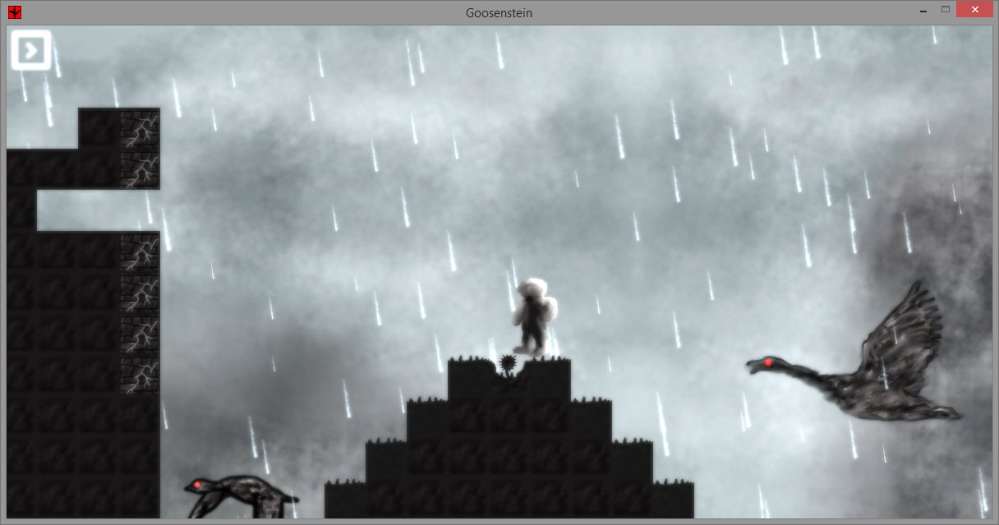

Goosenstein
===========

Goosenstein is a lovely 2D sidescroller, written for HackWATERLOO 2014.

Geese! Blocks! Unintentional features!

Novel yet beautiful, bizarre yet familiar, Goosenstein is a new way of appreciating our evil feathered friends.

Credits
-------

Anthony Zhang    - Lead Developer
Nerman Nicholas  - Level Design/Developer
Matas Empakeris  - Developer/Research/Level Design
Ankit Curchorcar - #GraphicDesigner
Elvin Yung       - Master Race Troll

Special Thanks to Dan Wolczuk for narration!

License
-------

Copyright 2014 Anthony Zhang (Uberi), Nerman Nicholas (iamnermann), Matas Empakeris (caliskimmer), Ankit Curchocar (kodemankit).

This mod is licensed under the [GNU Affero General Public License](http://www.gnu.org/licenses/agpl-3.0.html).

Basically, this means everyone is free to use, modify, and distribute the files, as long as these modifications are also licensed the same way.

Most importantly, the Affero variant of the GPL requires you to publish your modifications in source form, even if the program is run only on the server, and not distributed.
